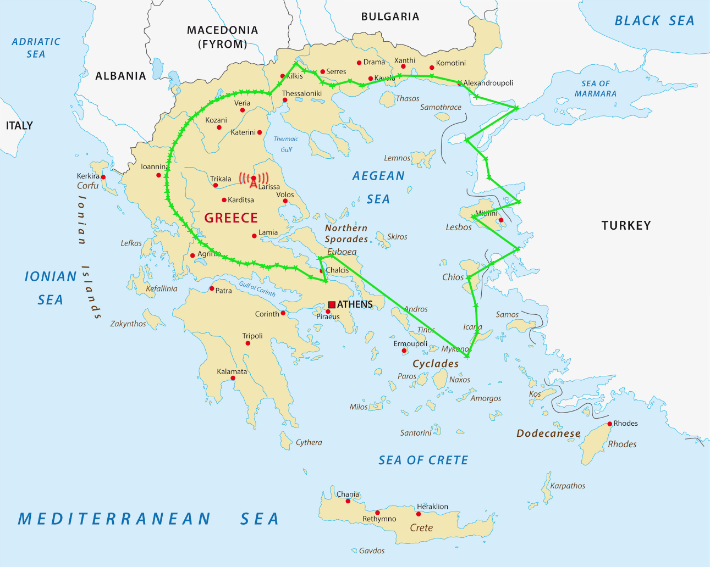

# Κεφάλαιο 2
# Πειραματικό / Ερευνητικό Μέρος

## 2.1 Προσδιορισμός Περιοχής Ραδιοκάλυψης

Στόχος της εργασίας είναι να προσδιοριστεί η θεωρητική σφαιρική ραδιοκάλυψη (κάθε 5 μοίρες) ενός ψηφιακού πομπού DRM στην πόλη της Λάρισας, λαμβάνοντας υπόψιν όλες τις παραμέτρους που αναλύθηκαν. Συγκεκριμένα οι τιμές τους:
- Για την κεραία:
	- SVM (Short Vertical Monopole)
	- Ισχύς 10 KW
	- Ύψος 10 m (πομπού και δέκτη)
- Για το σήμα:
	- Συχνότητα φορέα 1 MHz
	- Εύρος ζώνης 9 kHz
	- Robustness mode A2
	- 64QAM με protection level 3
	- Ground wave propagation χωρίς επιρροή από την ιονόσφαιρα
	- Minimum usable field strength 43.2 dB(μV)/m
- Για την διάδοση:
	- Ηλεκτρικές παράμετροι για την στεριά σ=3m/s και ε=22
	- Ηλεκτρικές παράμετροι για την θάλασσα σ=5m/s και ε=70
	- _**Μήπως να αναφέρουμε και το Ν?**_

Αρχικά επιλέχτηκε ένας πολιτικός χάρτης με κλίμακα [7] ώστε να σχεδιαστούν γραμμές για κάθε 5 μοίρες. Αυτό έγινε ώστε να εντοπιστεί εύκολα στον χάρτη η κάθε απόσταση μέχρι την οποία θα εκπέμπει το σήμα, καθώς και πού βρίσκονται οι εναλλαγές μεταξύ στεριάς και θάλασσας οι οποίες επηρεάζουν την διάδοση του.

**Εικόνα 3: Πολιτικός χάρτης Ελλάδας**

Για τον υπολογισμό των μέγιστης χρήσιμης απόστασης κάθε γραμμής χρησιμοποιήθηκε τροποποιημένα ο κώδικας της σύστασης ITU-R P.368 ως μέρος ενός προγράμματος αναζήτησης. Η ανάλυση του κώδικα γίνεται στο υποκεφάλαιο 2.2, αλλά με λίγα λόγια, το πρόγραμμα αναζήτησης παίρνει ως είσοδο τις εναλλαγές του τύπου εδάφους κάθε γραμμής και την ελάχιστη χρήσιμη στάθμη του σήματος (43.2 dB(μV)/m). Έπειτα παίρνει πολλά δείγματα από τους υπολογισμούς του κώδικα της σύστασης και μας δίνει ως έξοδο την μέγιστη απόσταση για κάθε γραμμή έως την οποία έχουμε ραδιοκάλυψη.

%%οι μεταβλητές εισόδου που θα ορίζονται κάθε φορά είναι η απόσταση d(km) και οι ηλεκτρικές παράμετροι ανάλογα με το είδος εδάφους. Για κάθε απόσταση κάθε γραμμής θα πρέπει το επιστρεφόμενο από τον κώδικα E να είναι μεγαλύτερο από το minimum usable field strength που ορίστηκε στο προηγούμενο κεφάλαιο το οποίο είναι 43.2 dB(µV)/m.

Στις περιπτώσεις όπου το έδαφος είναι ίδιου είδους τότε ως τελική τιμή Ε της ευθείας θα είναι η τιμή που επιστρέφει το πρόγραμμα. Όταν όμως υπάρχουν εναλλαγές εδάφους τότε θα ακολουθείται η διαδικασία που περιγράφει η _Εικόνα 2._%%

### 2.1.1 Εφαρμογή-Παράδειγμα καθορισμού ραδιοκάλυψης

Στην γραμμή που αντιπροσωπεύει τις 0 μοίρες δεν υπάρχει εναλλαγή στο είδος του εδάφους. Χρησιμοποιώντας μόνο τον κώδικα της σύστασης ITU-R P.368, μπορούμε δοκιμάζοντας διάφορες αποστάσεις με τις ηλεκτρικές παραμέτρους του εδάφους να βρούμε πειραματικά και με σχετική ευκολία πως η ραδιοκάλυψη φτάνει μέχρι τα 123 km.

**Εικόνα 4: Σημείο ραδιοκάλυψης για 0 μοίρες**

Στην γραμμή που αντιπροσωπεύει τις 50 μοίρες, υπάρχουν 5 τμήματα διαφορετικού εδάφους. Επομένως αν θέλουμε δούμε την στάθμη του σήματος κοντά στην Καβάλα, θα χρειαστεί με βάση την μέθοδο του Millington _(Εικόνα 2)_ να υπολογίσουμε 18 εκτιμήσεις με τον κώδικα της σύστασης ITU-R P.368 και να τις συνδυάσουμε. Η πειραματική εύρεση της μέγιστης απόστασης με το χέρι επομένως συναντάει μια δυσκολία. Για αυτόν ακριβώς τον λόγο αναπτύχθηκε το πρόγραμμα αναζήτησης, που μας επιστρέφει κατευθείαν το αποτέλεσμα στα 203.7 χμ.

**Εικόνα 6: Σημείο ραδιοκάλυψης για 50 μοίρες**

**Εικόνα 7: Αποτέλεσμα του προγράμματος αναζήτησης για 50 μοίρες**

### 2.1.2 Ολοκληρωμένη Περιοχή Ραδιοκάλυψης

Με τις διαδικασίες που περιγράφτηκαν παραπάνω μπορεί πλέον να οριστεί και να φανεί η περιοχή ραδιοκάλυψης του ψηφιακού πομπού DRM στην Λάρισα:

Αφου φτιαξεις το περιγραμμα, βαλτο εικονα εδω. Βγαλε ομως το μοιρογνωμονιο και οτι αλλο υπαρχει ωστε να φαινεται μονο ο χαρτης και το περιγραμμα 😊

## 1.2 Ανάλυση – Επεξήγηση κώδικα

Το πρόγραμμα αναζήτησης αναπτύχθηκε για να αυτοματοποιήσει την εύρεση της ραδιοκάλυψης.
Γράφτηκε σε Rust, η οποία είναι μια μοντέρνα υψηλού επιπέδου γλώσσα με ταχύτητα που αντιστοιχεί στην C.
Η επιλογή έγινε για να υλοποιηθεί σύντομα ένα πρόγραμμα που να μπορεί να κάνει αποδοτικά τους πολλούς υπολογισμούς που χρειάζονται χωρίς σφάλματα.
Οι βιβλιοθήκες της ίδιας της Rust και της κοινότητάς της μας παρέχουν εύκολη υλοποίηση πολλών κοινών διαδικασιών όπως το διάβασμα του αρχείου εισόδου και εννοιών όπως ο παραλληλισμός.

Η χρήση του προγράμματος γίνεται μέσω τερματικού και δίνοντας του ως ορίσματα το minimum usable field strength και ενδεχομένως το αρχείο με τις γεωγραφικές πληροφορίες κάθε γραμμής.
Αν δεν δοθεί αρχείο εισόδου, χρησιμοποιείται μία "hardcoded" γραμμή παραδείγματος.
Το αποτέλεσμα στην οθόνη του τερματικού είναι η απόσταση έως την οποία υπάρχει ραδιοκάλυψη για την κάθε γραμμή.

**Εικόνα 9: Παράδειγμα εκτέλεσης με την hardcoded γραμμή**

Το πρόγραμμα αναζήτησης μπορεί να χωριστεί σε 4 κομμάτια που το αποτελούν:
- Ο κώδικας της σύστασης ITU-R P.368
- Η ανάγνωση του αρχείου
- Ο αλγόριθμος αναζήτησης
- Τα διαδικαστικά (main, ανάγνωση ορισμάτων τερματικού κτλ)

### 1.2.1 Ο κώδικας της σύστασης ITU-R P.368

Ο κώδικας αυτός είναι επί της ουσίας μια βιβλιοθήκη γραμμένη σε C++.
Μας ενδιαφέρει η κύρια function που προσφέρει, η `LFMF`.
Η function αυτή δέχεται ως παραμέτρους τα ύψη των κεραιών, την απόσταση μεταξύ τους, την συχνότητα του φορέα, την ισχύ του πομπού, τις ηλεκτρικές ιδιότητες του εδάφους και την πόλωση του σήματος.
Η έξοδος της, αν είναι μέσα στα όρια που πρέπει οι παράμετροι, είναι η απώλεια διάδοσης και η τελική ισχύς του σήματος και του ηλεκτρικού πεδίου.

Για τον υπολογισμό, κοιτάζοντας την απόσταση των κεραιών και την συχνότητα του φορέα, αποφασίζει ανάμεσα σε δύο μεθόδους: την `FlatEarthCurveCorrection` και την `ResidueSeries`.
Η πρώτη είναι μια γρήγορη εκτίμηση με την χρήση του Flat Earth Approximation για κοντινές αποστάσεις και η δεύτερη χρησιμοποιεί την προσέγγιση του Norton με πιο ακριβή αποτελέσματα.

Τροποποιήθηκε ο κώδικας ώστε να μην χρησιμοποιείται η μέθοδος Flat Earth Approximation ώστε να γίνει δυνατή η χρήση της συνάρτησης LFMF στην μέθοδο του Millington για μεικτά εδάφη. Επίσης τροποποιήθηκε ώστε να απενεργοποιηθεί μια συντόμευση στους υπολογισμούς της `ResidueSeries` επειδή προκαλούσε σφάλματα.

### 1.2.2 Το αρχείο εισόδου

Οι πληροφορίες για κάθε γραμμή γράφονται σε ένα αρχείο Excel.
Κάθε γραμμή του Excel αντιστοιχεί σε μία γραμμή-δείγμα της σφαίρας κάλυψης.
Για κάθε γραμμή καταγράφεται η κατεύθυνσή της και έπειτα οι αποστάσεις από το κέντρο κάθε μετάβασης από ξηρά σε θάλασσα και το αντίστροφο.
Το αρχείο Excel μετά εξάγεται σε CSV, που είναι απλά αρχεία κειμένου που εύκολα διαβάζει μετά το πρόγραμμα, χωρίζει σε γραμμές, διαβάζει τις στήλες και μετασχηματίζει τα δεδομένα στην μορφή με την οποία τα χειρίζεται το πρόγραμμα.

### 1.2.3 Ο αλγόριθμος αναζήτησης

Η αναζήτηση έχει σκοπό να βρει την ραδιοκάλυψη πάνω σε μια γραμμή, με άλλα λόγια να προσδιορίσει έως πιο σημείο της γραμμής η στάθμη του σήματος είναι πάντα ίση ή πάνω από το όριο.
Επομένως οι είσοδοι είναι τα στοιχεία της γραμμής και το minimum usable field strength και έξοδος η απόσταση του ορίου της ραδιοκάλυψης.
Μετά από αρκετές δοκιμές, επιλέχθηκε μια μέθοδος "γραμμικής αναζήτησης" με σμικρυνόμενο βήμα.

Συγκεκριμένα, ο αλγόριθμος στην αρχή ψάχνει το πρώτο τμήμα εδάφους όπου η στάθμη στο τέλος του είναι κάτω από το όριο ώστε να επικεντρώσει την αναζήτηση σε αυτό.
Ύστερα από την αρχή του τμήματος αρχίζει με βήμα 5 χμ υπολογίζει την ένταση του πεδίου σε κάθε σημείο ώσπου να πέσει κάτω από το όριο.
Όταν γίνει αυτό, το βήμα διαιρείται δια 8 και επαναλαμβάνεται η διαδικασία από το τελευταίο σημείο με ένταση πάνω από την στάθμη.
Η διαίρεση του βήματος και μαζί η σύγκλιση στο σημείο του ορίου γίνεται μέχρι είτε να βρεθεί το σημείο με αρκετή ακρίβεια ή το βήμα γίνει μικρότερο από το 1 m.
Το πιο μακρινό σημείο με ένταση πάνω από την στάθμη θεωρείται το όριο της ραδιοκάλυψης και είναι η έξοδος του αλγορίθμου.

Για τον υπολογισμό της έντασης του πεδίου σε κάθε απόσταση, χρησιμοποιείται η συνάρτηση `LFMF` από τον κώδικα της σύστασης ITU-R P.368 σε συνδυασμό όπου χρειάζεται με την μέθοδο του Millington.